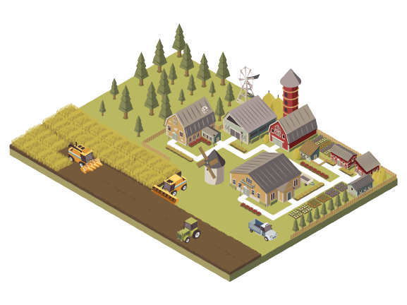
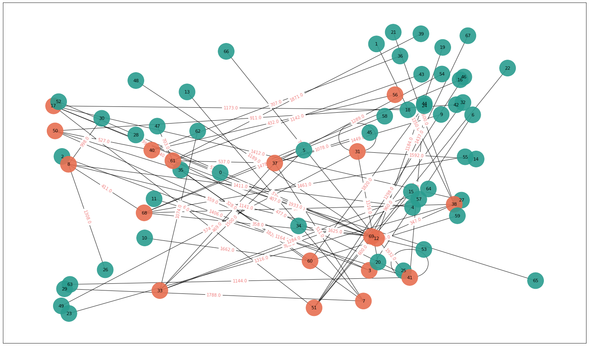

<!-- Improved compatibility of back to top link: See: https://github.com/othneildrew/Best-README-Template/pull/73 -->

<!--
*** Thanks for checking out the Best-README-Template. If you have a suggestion
*** that would make this better, please fork the repo and create a pull request
*** or simply open an issue with the tag "enhancement".
*** Don't forget to give the project a star!
*** Thanks again! Now go create something AMAZING! :D
-->

<!-- PROJECT LOGO -->
 

  <a href="https://github.com/MarioCela/Biogas_Location_and_Supply_Problem_OR">
    

<h3 align="center">Biogas Plants Location and Supply Planning Optimization Problem</h3>

  

    Biogas Location and Supply Problem - Foundations of Operations Research Big Project 2023 - Politecnico di Milano
     
     
    <a href="https://github.com/GiovanniBaccichet/biogasOR/issues">Report Bug :bug:</a>
    ·
    <a href="https://github.com/GiovanniBaccichet/biogasOR/issues">Request Feature ✨</a>
  

   

<!-- ABOUT THE PROJECT -->
## Biogas Plants Location Problem 🌾

An association of $n$ farmers wants to open $p$ plants to produce energy from biogas. 
Each plant will be opened at a farm of a member of the association and will be powered with corn chopping purchased from the farm itself or from other neighboring farms.

Each farm $i$ can provide at most $c_i$ tons of corn chopping, with a percentage of dry matter $a_i$. As you may know, dry matter is the key component of corn chopping used for biogas production. In order to maintain the quality of produced energy, each plant must burn a mixture of corn chopping with a percentage of dry matter between $k_{min}$ and $k_{max}$. 

At most one plant can be located in each farm, and every farm can sell its corn chopping to one and only one plant.

Each farm $i$ is located at coordinates $x_i$ and $y_i$, representing respectively its latitude and longitude, and the cost of moving corn chopping from a farm $i$ to a farm $j$ is proportional to the euclidean distance between the two farms (it does not depend on the actual quantity moved, since the trucks used for this transportations are sufficiently big). 

Under such conditions, every plant produces $Q$ kWh of energy per ton of corn chopping burned. The energy produced by each plant will be fed into the national electricity system, at a unitary price of $b$ (€/kWh). Moreover, due to state regulations, each plant must not produce more than $M$ kWh of energy.

You must locate $p$ plants among the available farms and assign the farms that will supply each plant, with the goal of maximizing the total revenues of the association.

  

(<a href="#readme-top">back to top</a>)

## Solution 🎯

The Python programming language is used to solve the problem. In particular, we used the MIP solver from the homonym package. In the first part of the notebook there is the modelling, with the definition of variables, constraints and objective function. In the second part there is the code that follows the path shown by the model. 

One of the main difficulties of the problem is to keep all the runtimes under 10 minutes. To do that, we used an heuristic. Considering that transportation costs are way less than the profits, we modified the objective function, removing the
calculation of costs. Furthermore, we decided to locate plants on farms that have the greater amounts of corn chopping. In this way, the optimization problem is reduced in finding the edges that must be activated for the transportation in order to maximize tons of material burnt.

Since we decided to use an heuristic, solutions are suboptimal, but considering the time that said approach takes to obtains valid results, we considered it to be a valid tradeoff between optimality and the resources spent to achieve satisfying results.

It follows an example of the optimization result. In particular, red nodes are the ones in which it is located a plant, green nodes ar just farms. Edges represent a transportation edge between the two nodes. On the axis, X and Y coordinates of the (given) farms.

You can find the Jupyter Notebook [here](notebook.ipynb).

If you want just the Python script, you can find it [here](src/main.py).

(<a href="#readme-top">back to top</a>)

<!-- CONTRIBUTING -->
## Contributing ✨

Contributions are what make the open source community such an amazing place to learn, inspire, and create. Any contributions you make are **greatly appreciated**.

If you have a suggestion that would make this better, please fork the repo and create a pull request. You can also simply open an issue with the tag "enhancement".
Don't forget to give the project a star! Thanks again!

1. Fork the Project
2. Create your Feature Branch (`git checkout -b feature/AmazingFeature`)
3. Commit your Changes (`git commit -m 'Add some AmazingFeature'`)
4. Push to the Branch (`git push origin feature/AmazingFeature`)
5. Open a Pull Request

(<a href="#readme-top">back to top</a>)

<!-- LICENSE -->
## License 📄

Distributed under the `GPLv3` License. See `LICENSE` for more information.

(<a href="#readme-top">back to top</a>)

<!-- CONTACT -->
## Group Members 👥

*Giovanni Baccichet* 

*Luca Cassenti* 

*Mario Cela* 

You can contact us by e-mail writing to: `name.surname@polimi.it`

(<a href="#readme-top">back to top</a>)

